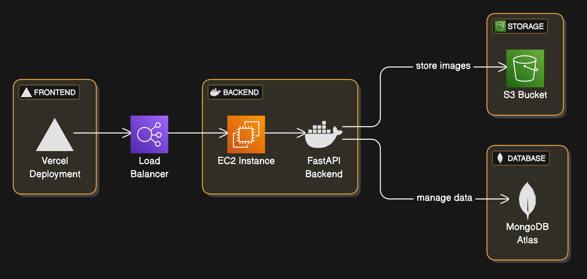

# SUTD WTH 2024
### Contributors
[Anika Handigol](https://github.com/anikahandigol)  
[Kaeden Lim](https://github.com/kaedenlim)  
[Lucas Wong](https://github.com/lucaswyl)  
[Izac Goh](https://github.com/hokkaido-milk)  
[Zane Chee](https://github.com/injaneity)  

## Backend
FastAPI backend Python environment, interacting with a MongoDB non-relational database for quick read write access. Sellers are provided with the abiltiy to add images, which is stored in a AWS S3 bucket. To improve search results and streamline the user experience, a GPT 4o vision to text model was used to identify key attributes of uploaded images and attach appropriate tags.

Local testing was done with a Python virtual environment.

### Backend Setup
```
cd backend

source venv/bin/activate

pip install -r requirements.txt
```

### Running Backend
```
fastapi dev app/main.py
```

## Frontend
NextJS framework of components from ShadCN, Neobrutalism and MagicUI. Tailwind CSS was used for further styling, and offers vibrant design with rich functionality. Users are able to create or interact with listings of items, and message the seller directly via Telegram.

For interested parties, a Google Maps API was integrated to show users nearby charities and foundations that could benefit from donations. To incentivise donations and giving away items to fellow students or those in need, a points system was introduced.

### Frontend Setup
```
cd frontend

npm install
```

### Running Frontend
```
npm run dev
```

## Deployment


Frontend is hosted on Vercel.
FastAPI backend is hosting on AWS EC2 instance, with a docker image. Static images uploaded by users are hosted on an AWS S3 bucket, and is referred to by the Altas-hosted non relational MongoDB. A microservice architecture offers significant benefits in scalability and maintainability.